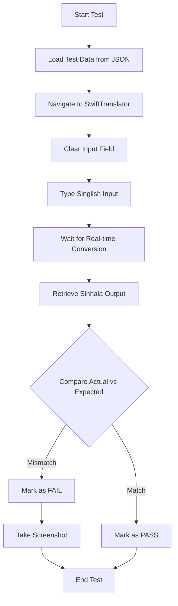

# SwiftTranslator Playwright Automation Testing 🎯

## 📌 Project Information

**Course:** IT3040 - ITPM Semester 2  
**Student ID:** IT23243026  
**Assignment:** Playwright TypeScript Automation Testing  
**System Under Test:** [SwiftTranslator.com](https://www.swifttranslator.com/)  
**Technology Stack:** Playwright + TypeScript + Node.js  
**Design Pattern:** Page Object Model (POM)

---

## 📋 Project Overview

This project automates functional and UI testing for the **SwiftTranslator** web application, which performs **real-time Singlish to Sinhala transliteration**.

### Test Coverage

| Test Type | File Name | Test Cases | Purpose |
|-----------|-----------|------------|---------|
| **Positive Functional** | `positive-functional.spec.ts` | 24 | Validate correct transliteration |
| **Negative Functional** | `negative-functional.spec.ts` | 10 | Test system robustness |
| **UI Behavior** | `ui.spec.ts` | 3 | Verify real-time conversion UI |

**Total Test Cases:** 37

---

## 🗂️ Project Structure

```
swifttranslator-playwright/
│
├── tests/                                  # Test specification files
│   ├── positive-functional.spec.ts        # 24 positive test cases
│   ├── negative-functional.spec.ts        # 10 negative test cases
│   └── ui.spec.ts                         # 3 UI behavior tests
│
├── pages/                                  # Page Object Model
│   └── translator.page.ts                 # TranslatorPage POM class
│
├── test-data/                              # Test data (JSON format)
│   ├── positive-functional.json           # 24 positive test cases
│   ├── negative-functional.json           # 10 negative test cases
│   └── ui-tests.json                      # 1 UI test case
│
├── screenshots/                            # Auto-generated screenshots
│   └── (failure screenshots saved here)
│
├── playwright-report/                      # HTML test reports
│   └── (generated after test run)
│
├── test-results/                           # JSON test results
│   └── results.json
│
├── playwright.config.ts                    # Playwright configuration
├── package.json                            # Project dependencies
├── package-lock.json                       # Dependency lock file
├── tsconfig.json                           # TypeScript configuration
└── README.md                               # This file
```

---

## ⚙️ Installation & Setup

### Prerequisites

- **Node.js** (version 18 or higher)
- **npm** (comes with Node.js)
- **Git** (for version control)

### Step 1: Install Dependencies

```powershell
npm install
```

This will install:
- Playwright Test Framework
- TypeScript
- All required dependencies

### Step 2: Install Playwright Browsers

```powershell
npx playwright install
```

This downloads Chromium, Firefox, and WebKit browsers.

---

## 🚀 Running Tests

### Run All Tests

```powershell
npm test
```

### Run Specific Test Suites

```powershell
# Positive functional tests (24 cases)
npm run test:positive

# Negative functional tests (10 cases)
npm run test:negative

# UI behavior tests (3 cases)
npm run test:ui
```

### Run Tests on Specific Browsers

```powershell
# Run on Chromium (Google Chrome)
npm run test:chromium

# Run on Firefox
npm run test:firefox

# Run on WebKit (Safari)
npm run test:webkit
```

### Run Tests with UI Mode (Recommended for Debugging)

```powershell
npm run test:ui-mode
```

This opens Playwright's interactive UI where you can:
- Watch tests execute in real-time
- Pause and step through tests
- Inspect elements
- View detailed logs

### Run Tests in Headed Mode (See Browser)

```powershell
npm run test:headed
```

### Debug Individual Tests

```powershell
npm run test:debug
```

### Run Specific Test Case by ID

```powershell
# Example: Run only Pos_Fun_0001
npx playwright test -g "Pos_Fun_0001"

# Example: Run only Neg_Fun_0003
npx playwright test -g "Neg_Fun_0003"
```

---

## 📊 View Test Reports

### View HTML Report

After running tests, generate and open the HTML report:

```powershell
npm run report
```

Or manually:

```powershell
npx playwright show-report
```

This opens a beautiful HTML report showing:
- ✅ Passed tests
- ❌ Failed tests
- Screenshots of failures
- Execution time
- Detailed logs

---

## 🧪 Test Execution Logic

### Positive Functional Tests ✅

**Purpose:** Validate correct Singlish to Sinhala transliteration

**Process:**
1. Load test case from `positive-functional.json`
2. Type Singlish input into textarea
3. Wait for real-time conversion (1-2 seconds)
4. Retrieve Sinhala output
5. Compare actual output with expected output
6. Mark as **PASS** if they match, **FAIL** otherwise
7. Take screenshot on failure

**Example Test Case:**
- **Input:** `mama gedhara yanavaa`
- **Expected Output:** `මම ගෙදර යනවා`
- **Status:** PASS if actual = expected

---

### Negative Functional Tests ⚠️

**Purpose:** Test system robustness under incorrect/messy inputs

**Process:**
1. Load problematic test case from `negative-functional.json`
2. Type incorrect/messy Singlish input
3. Wait for conversion
4. Compare actual output with ideal expected output
5. Mark as **PASS** if system handles edge case correctly
6. Mark as **FAIL** if system cannot process correctly (expected behavior)
7. Use soft assertions to continue testing
8. Verify page remains responsive

**Important Note:**
- Negative tests are **allowed to FAIL**
- They document system limitations
- Goal is to test robustness, not correctness

**Example Test Case:**
- **Input:** `MaMa GeDaRa YaNaVa` (random capitalization)
- **Expected Output:** `මම ගෙදර යනවා`
- **Status:** FAIL (system cannot normalize casing)

---

### UI Behavior Tests 🖥️

**Purpose:** Validate real-time conversion and usability

**What is Tested:**
- ✅ Real-time output updates while typing
- ✅ No button click required for conversion
- ✅ Input clear functionality
- ✅ Page responsiveness (no crashes)
- ✅ Multiple conversions consistency

**Process:**
1. Type Singlish text character by character
2. Verify output updates automatically in real-time
3. Confirm no manual button click needed
4. Test input clear behavior
5. Check page stability

---

## 🎓 Key Features (Examiner-Friendly)

### ✅ Design Patterns & Best Practices

1. **Page Object Model (POM)**
   - Centralized locators in `translator.page.ts`
   - Reusable methods for all tests
   - Easy maintenance

2. **Data-Driven Testing**
   - Test data separated into JSON files
   - No hardcoded values in test scripts
   - Easy to add/modify test cases

3. **Clear Comments**
   - Step-by-step explanations
   - // Step 1, // Step 2, etc.
   - Easy for examiners to understand

4. **Screenshot on Failure**
   - Automatic screenshots for failed tests
   - Saved in `screenshots/` folder
   - Useful for debugging

5. **Comprehensive Reporting**
   - HTML reports with detailed logs
   - JSON results for CI/CD integration
   - Console output with color coding

---

## 📦 Dependencies

| Package | Version | Purpose |
|---------|---------|---------|
| `@playwright/test` | ^1.48.0 | Playwright test framework |
| `typescript` | ^5.7.2 | TypeScript compiler |
| `@types/node` | ^22.10.5 | Node.js type definitions |

---

## 🔧 Configuration Files

### `playwright.config.ts`

Configures:
- Test directory location
- Browser settings (Chromium, Firefox, WebKit)
- Timeout values
- Reporter configuration
- Screenshot and video capture
- Parallel execution

### `tsconfig.json`

TypeScript configuration for:
- Target ES6 compilation
- Node.js module resolution
- Type checking settings

---

## 📝 Test Data Format

### JSON Structure

```json
[
  {
    "tcId": "Pos_Fun_0001",
    "input": "mama gedhara yanavaa",
    "expectedOutput": "මම ගෙදර යනවා"
  }
]
```

---

## 🎯 Automation Workflow



---

## 🚨 Troubleshooting

### Issue: Browsers not installed

**Solution:**
```powershell
npx playwright install
```

### Issue: Tests failing due to timeout

**Solution:** Increase timeout in `playwright.config.ts`
```typescript
timeout: 60000, // Increase to 60 seconds
```

### Issue: Cannot find module errors

**Solution:**
```powershell
npm install
```

### Issue: TypeScript errors

**Solution:**
```powershell
npx tsc --noEmit
```

---

## 📚 Additional Resources

- [Playwright Documentation](https://playwright.dev/)
- [TypeScript Documentation](https://www.typescriptlang.org/)
- [Page Object Model Pattern](https://playwright.dev/docs/pom)
- [SwiftTranslator Website](https://www.swifttranslator.com/)

---

## 🎓 University Assignment Guidelines

### ✅ Checklist for Submission

- [x] Page Object Model implemented
- [x] Test data in JSON format (not hardcoded)
- [x] Clear step-by-step comments
- [x] Screenshot on failure
- [x] README.md with installation instructions
- [x] All tests runnable with `npm test`
- [x] Proper folder structure
- [x] TypeScript with strict typing

### 📤 Submission Format

1. **GitHub Repository:** Push code to public GitHub repo
2. **ZIP File:** Create zip with format `IT23243026_PlaywrightAutomation.zip`
3. **Include:**
   - All source code
   - Test data JSON files
   - README.md
   - package.json
   - screenshots folder (optional)

---

## 📧 Contact Information

**Student ID:** IT23243026  
**Course:** IT3040 - ITPM Semester 1  
**Assignment:** Playwright Automation Testing

---

## 📄 License

This project is created for educational purposes as part of a university assignment.

---

## ✨ Conclusion

This Playwright automation project demonstrates:
- ✅ Professional test automation practices
- ✅ Clean, maintainable code structure
- ✅ Comprehensive test coverage
- ✅ Real-world testing scenarios
- ✅ University assignment standards

**Thank you for reviewing this project! 🎓**

---

*Last Updated: January 29, 2026*
